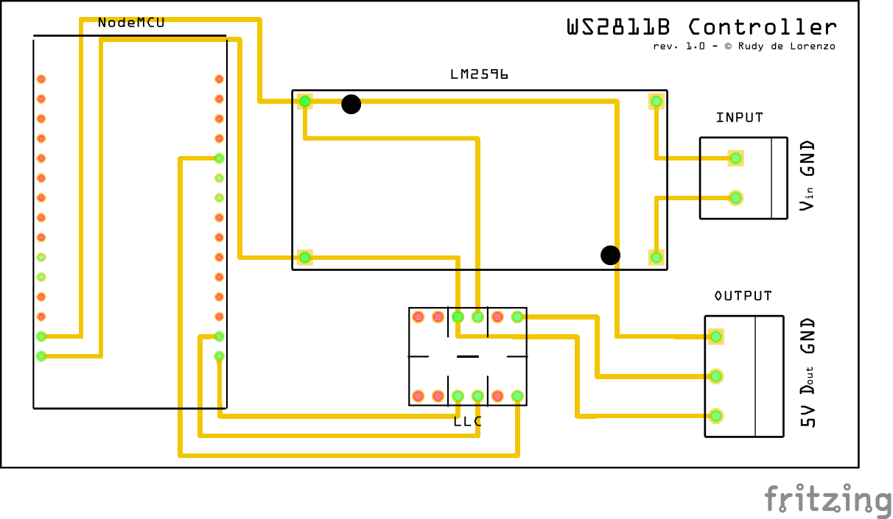

# WS2811B Controller PCB
A PCB design (made in Fritzing) for a WS2811B controller.

This is repository includes Gerber as well as an editable Fritzing file.

## Components
* a NodeMCU ESP8266,
* an LM2596 DC-DC Converter,
* a logic level converter,
* and two screw terminals.

## PCB

## Usage
The intended application for this circuit is to take in any voltage, and output a signal to a 5V WS2811B LED strip.

WLED can be run on the NodeMCU to allow for wireless control of the strip.
